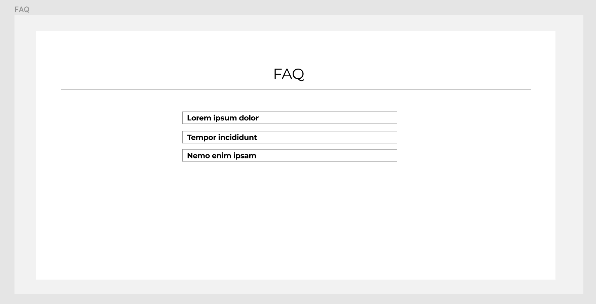

# capstone project

[Sprint Document](https://docs.google.com/document/d/1IxRpNGvbM4Nlj_5hlvuj5SYJhyylD2zGQAh6OmjOIKs/edit?usp=sharing)

[Website](http://nyein-aung.com/spd1.2/)

# Wireframes Capstone

<html>
<iframe 
style="border: 1px solid rgba(0, 0, 0, 0.1);" 
width="800" 
height="450" 
src="https://www.figma.com/embed?embed_host=share&url=https%3A%2F%2Fwww.figma.com%2Ffile%2FDVtAX05o53YF90t0J6NgT8%2FPokeTrack" 
allowfullscreen></iframe>
</html>

## Entire Page

## NAVIGATION

## FEATURES

## FAQ

## SIGN UP

## Testimonial

## FOOTER / CONTACT

